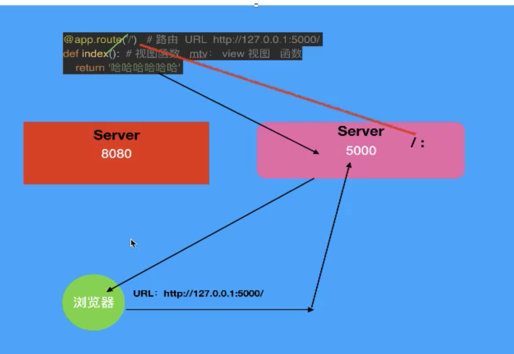
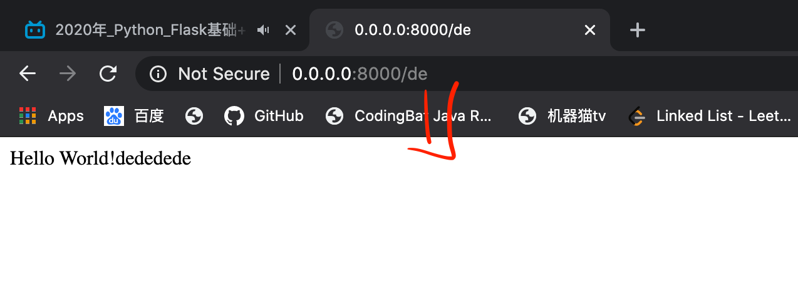
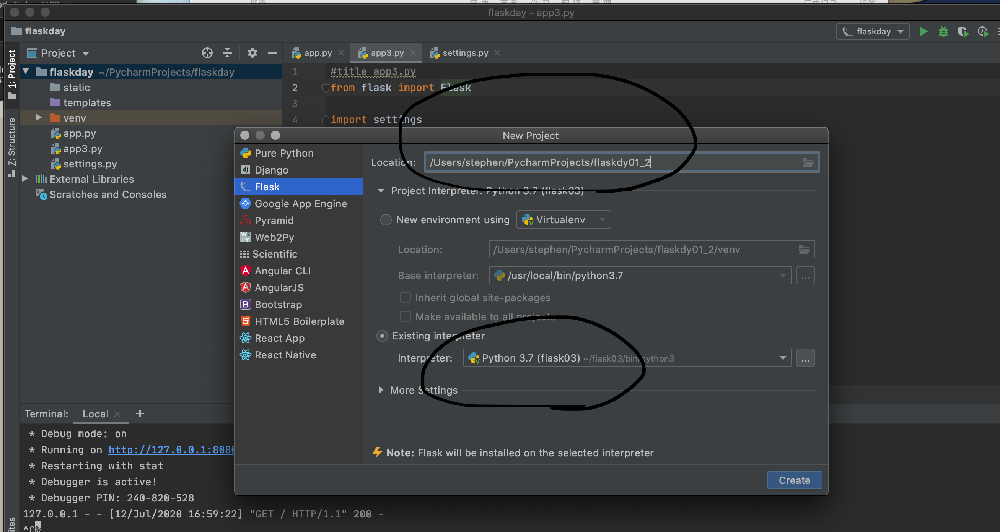
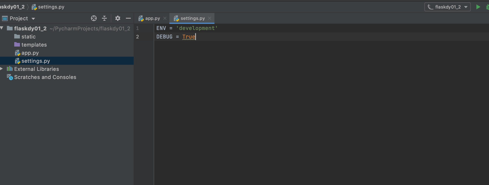
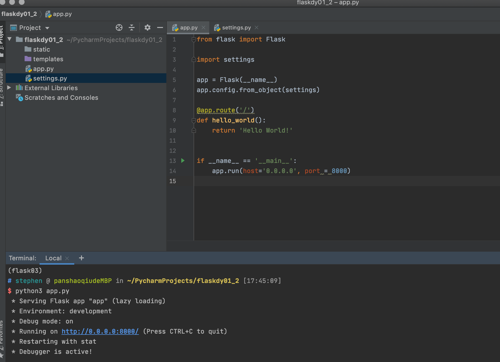

# Day2
* reference：
<a href ="https://www.bilibili.com/video/BV1nV411k79y?p=4">1.3 flask的配置----1.4 flask请求与响应</a>

## 删除隐藏文件和编译bash小技巧

1. 从go里面去recent file找到位置
2. 按住shift+command+> 显示出hidden files
3. terminal 输入open .bash_profile 

## 404 error
上网时看见的404 报错是web serve没有该内容

## 整个流程


```py
## 在虚拟环境中的app.py
from flask import Flask

app = Flask(__name__)

# 装饰器
@app.route('/')     #路由     http://127.0.0.1:5000/ (python3 app.py)
def hello_world():      #视图函数       即mtv： view视图

    return 'Hello World!'           #打印在浏览器上


if __name__ == '__main__':
    app.run(port=8000)           # 默认端口号5000        按住control键点击run
    #app.run(port=8000)     #设置成端口号8000     --> http://127.0.0.1:8000/
    #app.run(host='0.0.0.0', port=8000)         默认本机访问，如果想外网访问，则需要加上host’0.0.0.0‘
    #app.run(host='0.0.0.0', port=8000, degbug=True) -> debug=True  开启了调试模式， 只要代码改变， 服务器会重新加载最新代码， 适用于开发环境 development
    debug = Flase 适用于 production环境
    #run(host='ip 地址'， port=‘端口号’)， 一个端口号对应一个程序

```
----
## 3种环境:
* production
* development
* testing

```py
from flask import Flask

app = Flask(__name__)
print(app.config)
#设置环境
app.config['ENV'] = 'development'
#调整是否debug
app.config['DEBUG'] = True

@app.route('/')
def index():
    return '欢迎大家！~~'

if __name__ == '__main__':
    app.run()
```
----

## settings.py  配置文件
将所有配置放在里面， 让app.py直接调用， 更轻松简洁

## 不同路径进入不同函数
```py
@app.route('/')
def hello_world():
    return 'Hello World!'

@app.route('/wo')
def hello_world1():
    return 'Hello World!wowowowo'

@app.route('/de')
def hello_world2():
    return 'Hello World!dededede'

if __name__ == '__main__':
    app.run(host='0.0.0.0', port = 8000)
```


## 路由的请求和响应
浏览器地址栏输入的内容：    http://192.168.1.5/index  ->服务器 --> app---> 有没有这个路由 -> 路由匹配的函数--> return 'hello world' --> response -->客户端浏览器
---------
----------
## <strong>summary  环境步骤
1. 在terminal里先创建名为flask03虚拟环境        （-p python3.7 是因为要用python3的版本）
mkvirtualenv -p python3.7 flask03               
2. 如果失败
sudo pip install virtualenv

3. 在pycharm的flask里创建项目 从刚刚创立的flask03环境中打开
    


4. （也可以自己在terminal直接输入）
pip3 install flask

5. 设置当前环境



6. 导入环境， 设置host port



---------